# Usecase 02- Build sales analytics with AdventureWorks dataset using Fabric data agent

## Introduction

Contoso Analytics, a retail insights team, is transitioning its
reporting workflows to **Microsoft Fabric** to improve data
accessibility for analysts and business managers. The team wants to
enable natural‑language data exploration so non‑technical users can get
insights without writing SQL or navigating dashboards.

To achieve this, the team decides to build an **intelligent analytics
assistant** powered by a **Fabric Data Agent**. The first step in this
process is to prepare the underlying data in a **Fabric Lakehouse**. As
outlined in the Fabric data agent tutorial, they begin by **creating and
populating a Lakehouse**, which will hold curated retail datasets such
as sales transactions, product inventory, and store profiles. This
Lakehouse serves as the governed, centralized data source for downstream
tasks.

Once the Lakehouse is set up, the next step is to make it accessible to
conversational systems and automation tools. The team accomplishes this
by **creating a Fabric Data Agent** and **adding the Lakehouse as its
connected data source**, enabling secure, governed access to the data.
This configuration allows the Data Agent to understand and query the
Lakehouse content, forming the foundation for building natural‑language
experiences across the organization.

With the Lakehouse connected through the Fabric Data Agent, Contoso can
now integrate the agent into analytics applications, Copilot
experiences, and internal tools—empowering business users to ask
questions like *“Show me today’s sales for the south region”* or
*“Identify the lowest‑stock products across all stores”* and receive
data‑driven answers instantly.

## Objectives

- Build a **Fabric Lakehouse** and load AdventureWorks datasets
  programmatically using notebooks.

- Create and configure a **Fabric Data Agent** connected to Lakehouse
  tables.

- Improve the agent’s responses using **instructions and example
  queries**.

- Publish the agent and test it **programmatically via API calls**
  inside a Fabric notebook.

- Clean up and delete the workspace after completing the lab.


## Task 1: Create a lakehouse with AdventureWorksLH

In this task, you will create a new Lakehouse and populate it with AdventureWorks tables using a Fabric notebook, establishing a structured data foundation that the Data Agent can query.

1. In the workspace home page, click on the **+New item** button in the navigation bar t create a new lakehouse.

    

1. In the **New item** window, search for **Lakehouse (1)** in the search bar and select **Lakehouse (2)** from the results to create a new Lakehouse item.

    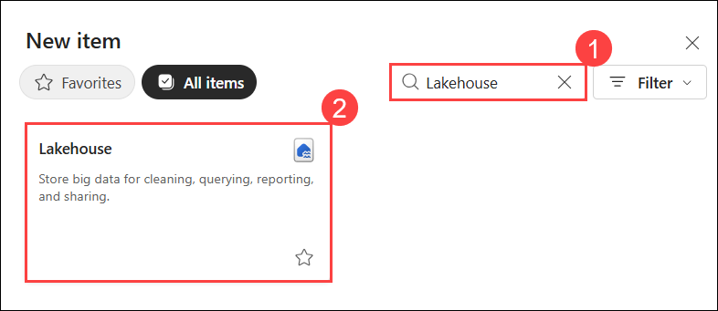

1. In the **New lakehouse** dialog box, enter the following name in the **Name** field:

1. In the **New lakehouse** dialog box, enter **AdventureWorksLH (1)** in the **Name** field, and leave **Lakehouse schemas (2)** unchecked. Click **Create (3)** to proceed.

    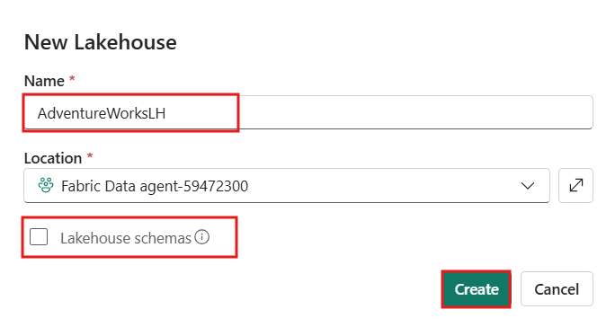

    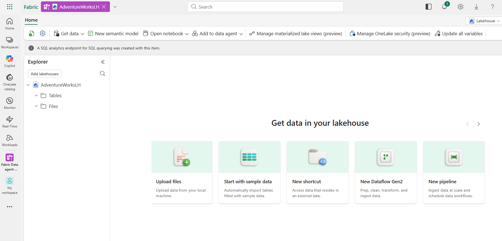

1. You will see a notification stating **Successfully created SQL endpoint**.

    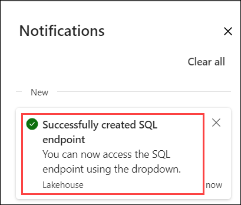

1. In the **Lakehouse** page, click **Open notebook (1)** and select **New notebook (2)** to create your Fabric data agent.

    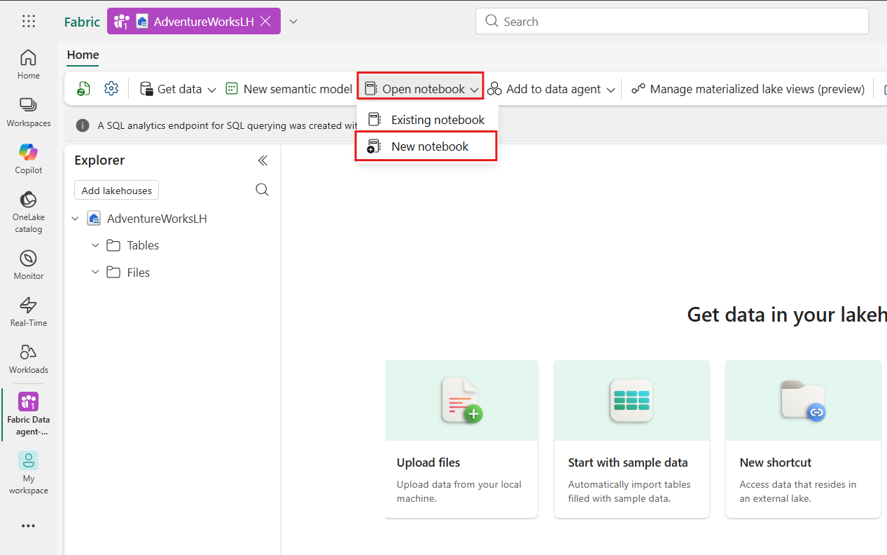

1. In your notebook, use the **+ Code (1)** icon to add a new code cell to the notebook.

1. Enter the following code in the cell **(2)**. Select the code cell and click on the **Run cell (3)** button to execute cell. Monitor the **Spark job progress and completion status** in the output section to ensure all tables are successfully uploaded to the Lakehouse.

    ```
    import pandas as pd
    from tqdm.auto import tqdm
    base = "https://synapseaisolutionsa.z13.web.core.windows.net/data/AdventureWorks"

    # load list of tables
    df_tables = pd.read_csv(f"{base}/adventureworks.csv", names=["table"])

    for table in (pbar := tqdm(df_tables['table'].values)):
        pbar.set_description(f"Uploading {table} to lakehouse")

        # download
        df = pd.read_parquet(f"{base}/{table}.parquet")

        # save as lakehouse table
        spark.createDataFrame(df).write.mode('overwrite').saveAsTable(table)
    ```

    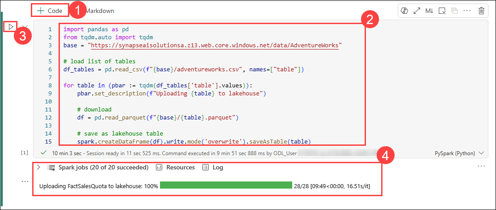

    > **Note:** Wait until the progress reaches 100%.    

1. Expand the **AdventureWorksLH (1)** Lakehouse , expand the **Tables (2)** folder, click on the **ellipsis (⋯) (3)** next to Tables, and select **Refresh (4)** to load and verify that all newly created tables are successfully loaded into the Lakehouse.

    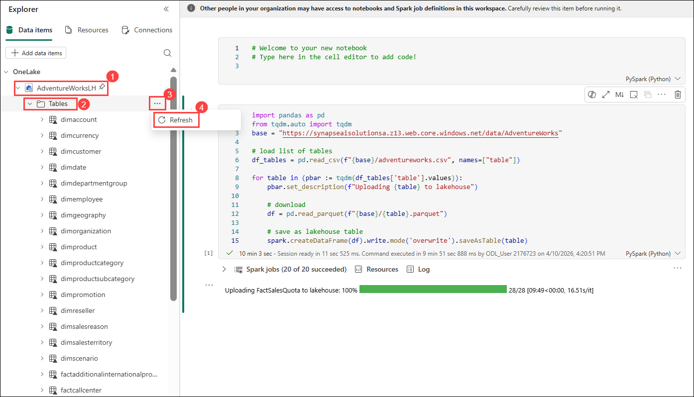

## Task 3: Create and configure a Fabric Data Agent connected to Lakehouse tables.

In this task, you will create a Fabric Data Agent and connect it to the
Lakehouse. You will select the required Dimension and Fact tables to
enable the agent to answer a wide range of sales‑related analytics
questions.

1. Now, click on **Fabric Data agent-<inject key="DeploymentID" enableCopy="false"></inject> (1)** on the left-sided navigation pane, then select the **Fabric Data agent-<inject key="DeploymentID" enableCopy="false"></inject> (2)** workspace to open and see the items created.

    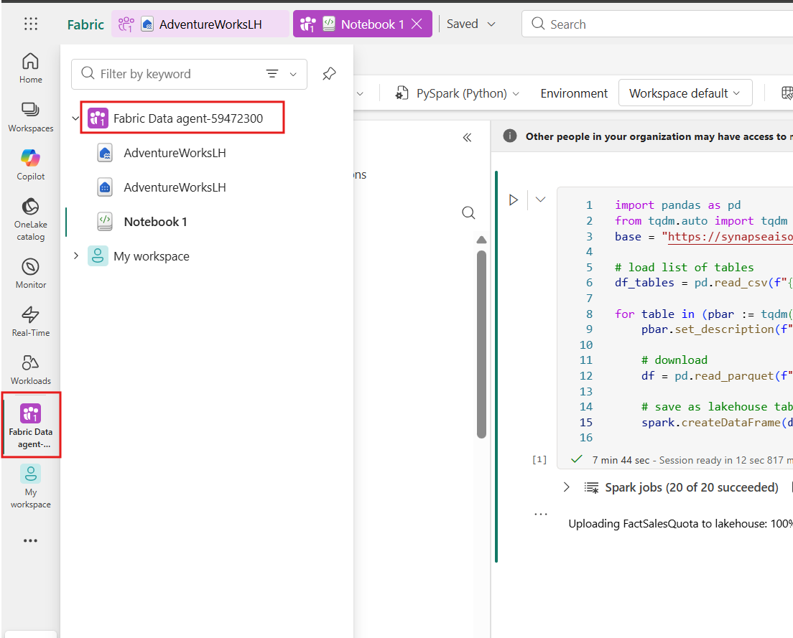

1. In the workspace, Click **+ New item (1)**, search for **Data agent (2)** in the search bar, and select the **Data agent (3)** option to create a new Fabric Data Agent.

    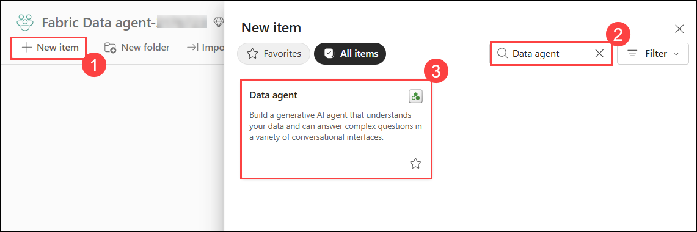

1. Enter **AI-agent (1)** as the Data agent name and select **Create (2)**.

    

1. In AI-agent page, select **Add Data (1)** and from the dropdown choose **Data source (2)**.

    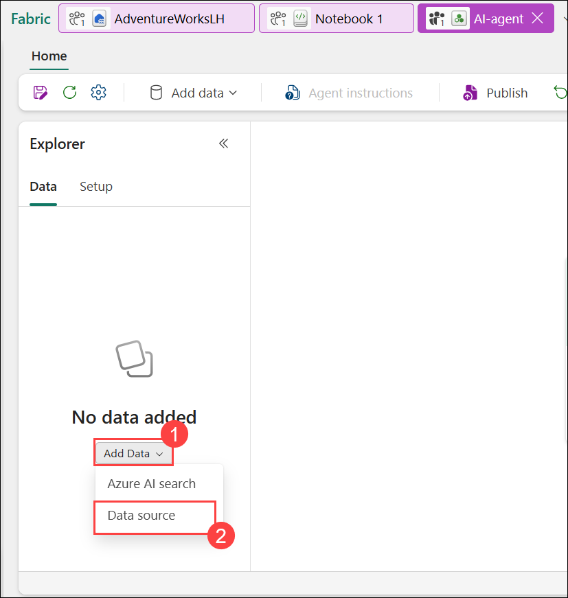

1. In the **OneLake catalog** tab, select the **AdventureWorksLH (1)** and select **Add (2)**.

    

1. You must then select the tables for which you want the AI skill to have available access.

    This lab uses the following tables:

    - DimCustomer

    - DimDate

    - DimGeography

    - DimProduct

    - DimProductCategory

    - DimPromotion

    - DimReseller

    - DimSalesTerritory

    - FactInternetSales

    - FactResellerSales

       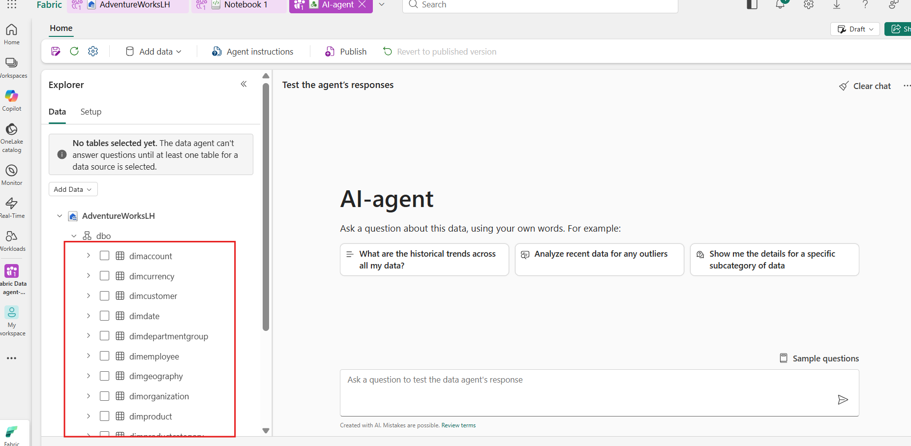

## Task 4: Provide instructions

In this task, you will enrich the Data Agent by adding natural language questions along with their corresponding SQL queries. These examples help the agent understand domain-specific context and generate more accurate SQL responses for real-world queries. You will add relevant question–SQL pairs, validate their accuracy, test how the agent responds to similar queries, and refine the examples to improve the agent’s performance.


1. Select the **factinternetsales (1)** table from the left navigation pane, enter the following prompt **(2)** in Test the agent's responses section:

    ```
    What is the most sold product?
    ```

1. Expand the execution details by clicking **“1 step completed” (3)**, then expand the query details **(4)**, copy the generated **SQL query (5)** and paste it into the **Notepad** for further use.

1. Once the query is copied, click **Clear chat (6)** to reset the conversation for a new prompt.

    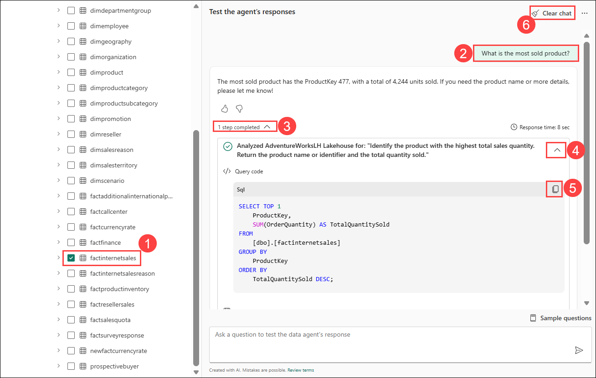

1. Select the **factresellersales (1)** table from the left navigation pane, enter the following prompt **(2)** to Test the agent's responses.

    ```
    What is our most sold product?
    ```

1. Review the **output (3)** generated, then click **Clear chat (4)** to reset the conversation for a new prompt.

    

1. Select the **dimcustomer (1)** table from the left pane, enter the following prompt **(2)** to Test the agent's responses.

    ```
    how many active customers did we have June 1st, 2013?
    ```

1. Expand the execution details by clicking **“1 step completed” (3)**, review the generated SQL query which counts customers where DateFirstPurchase <= '2013-06-01' to determine active customers by expanding the query section **(4)**, copy the generated **SQL query (5)** and paste it into the **Notepad** for further use. 

1. Once the query is copied, click **Clear chat (6)** to reset the conversation for a new prompt.

    

    > **Note:** Before running the next prompt, click **Clear chat (6)** to reset the conversation for better results.

1. Select the **dimdate (1)** and **factinternetsales (2)** tables from the left pane, enter the following prompt **(3)** to Test the agent's responses.

    ```
    what are the monthly sales trends for the last year?
    ```

1. Expand the execution details by clicking **“1 step completed” (4)**,  and expand the query details **(5)** further where the SQL joins the tables, aggregates monthly sales, and filters for the latest year. Copy the generated **SQL query (6)** and paste it into the **Notepad** for further use. 

    

    > **Note:** Before running the next prompt, click **Clear chat (6)** to reset the conversation for better results.

1. Select the **dimproduct (1)** and **factinternetsales (2)** tablesfrom the left pane, enter the following prompt **(3)** to Test the agent's responses.
   
    ```
    which product category had the highest average sales price?
    ```

1. Expand the execution details by clicking **“1 step completed” (4)**,  and expand the query details **(5)** further where the review shows the category with the highest average sales price. Copy the generated **SQL query (6)** and paste it into the **Notepad** for further use.

    

1. The relevant query is moderately complex, so provide an example by selecting the **Example queries (2)** button from the **Setup (1)** pane.

    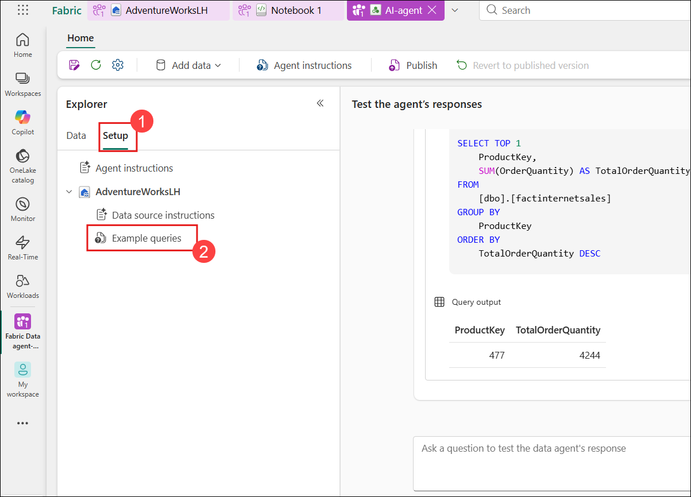

1. In the **Example queries (1)** tab, select the **Add example (2).**

    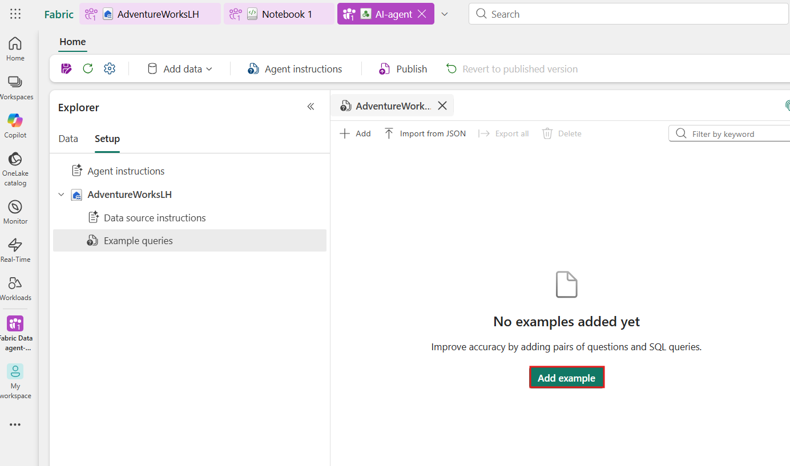

1. Here, you should add Example queries for the lakehouse data source
  that you have created. Add the **below question (1)** in the question field:
    
    ```
    What is the most sold product?
    ```

1. For **SQL query (2)** either add the query1 that you have saved in the notepad or add the following query:

    ```
    SELECT TOP 1 ProductKey, SUM(OrderQuantity) AS TotalQuantitySold
    FROM [dbo].[factinternetsales]
    GROUP BY ProductKey
    ORDER BY TotalQuantitySold DESC
    ```

    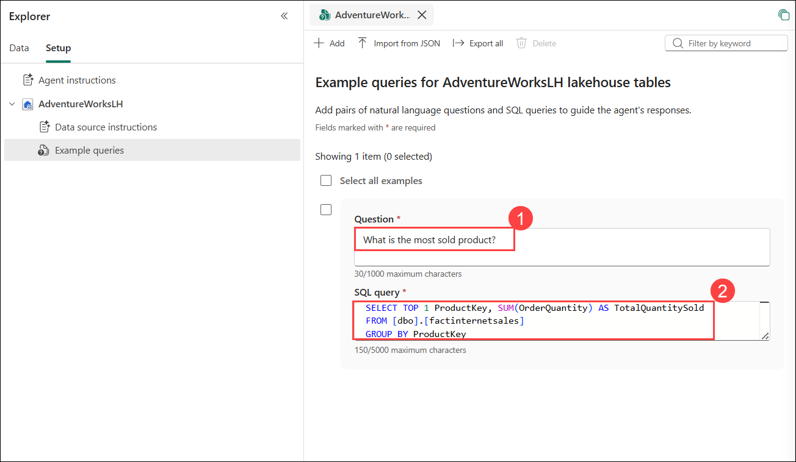

1. To add a new query field, click on **+ Add (1).** Add the **below question (2)** in the question field:

    ```
    What are the monthly sales trends for the last year?
    ```

1. For **SQL query (3)** either add the query2 that you have saved in the notepad or add the following query:

    ```
    SELECT
    d.CalendarYear,
    d.MonthNumberOfYear,
    d.EnglishMonthName,
    SUM(f.SalesAmount) AS TotalSales
    FROM
    dbo.factinternetsales f
    INNER JOIN dbo.dimdate d ON f.OrderDateKey = d.DateKey
    WHERE
    d.CalendarYear = (
        SELECT MAX(CalendarYear)
        FROM dbo.dimdate
        WHERE DateKey IN (SELECT DISTINCT OrderDateKey FROM dbo.factinternetsales)
    )
    GROUP BY
    d.CalendarYear,
    d.MonthNumberOfYear,
    d.EnglishMonthName
    ORDER BY
    d.MonthNumberOfYear
    ```

    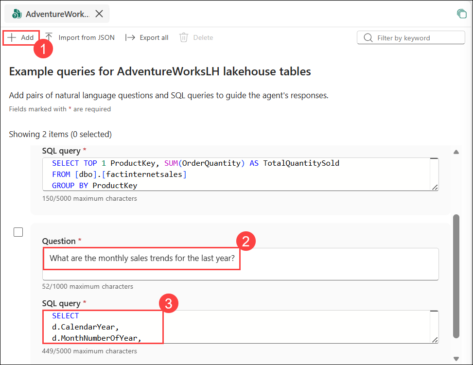

1. To add a new query field, click on **+ Add (1).** Add the **below question (2)** in the question field:

    ```
    Which product category has the highest average sales price? 
    ```

1. For **SQL query (3)** either add the query3 that you have saved in the notepad or add the following query:

    ```
    SELECT TOP 1
    dp.ProductSubcategoryKey AS ProductCategory,
    AVG(fis.UnitPrice) AS AverageSalesPrice
    FROM
    dbo.factinternetsales fis
    INNER JOIN
    dbo.dimproduct dp ON fis.ProductKey = dp.ProductKey
    GROUP BY
    dp.ProductSubcategoryKey
    ORDER BY
    AverageSalesPrice DESC
    ```

1. Once all the questions and SQL queries are added, then click on **Export all (4)** to export the examples.

    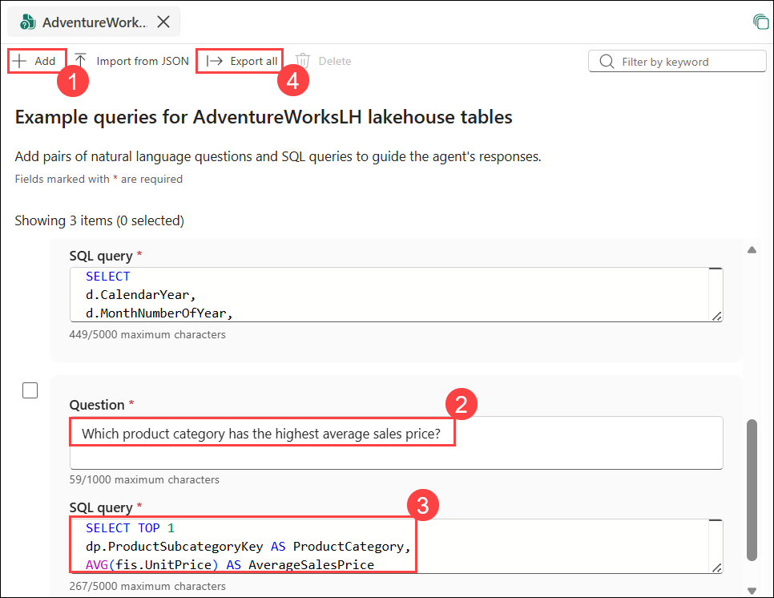

    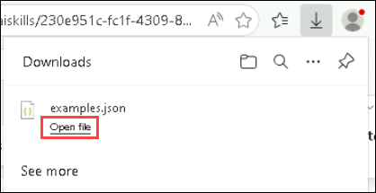

## Task 5: Use the Data agent programmatically

In this task, you will validate and enhance the Data Agent by reviewing its instructions and examples, and by using the AI skill programmatically within a Fabric notebook. You will check whether the AI skill is properly configured and confirm that a published URL is available. You will then use the AI skill within a Fabric notebook to test responses using sample queries, and refine the instructions and examples based on the results to improve its overall effectiveness.

1. In the Data agent Fabric page, in the **Home** ribbon select the **Settings gear icon**.

   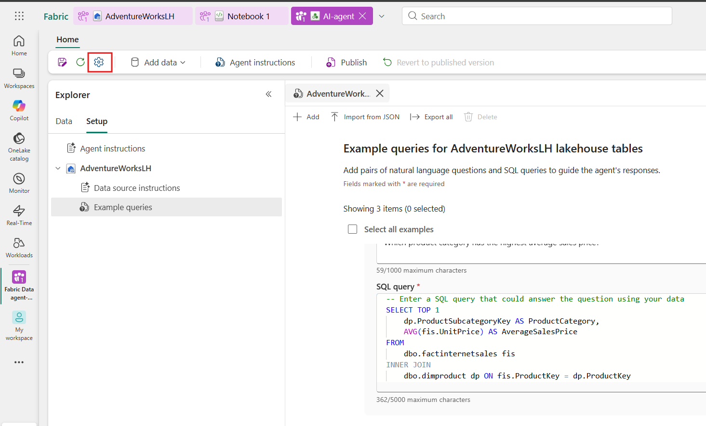

1. Before you publish the AI-agent, navigate to **Publishing (1)** section, and verify it doesn't have a **published URL** value, click **X (2)** to close the AI-agent settings pane.

   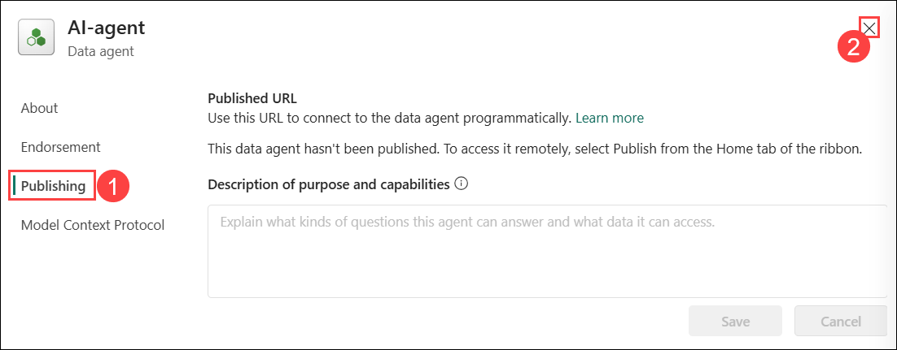

1. In the **Home** ribbon, select the **Publish**.

   
 
   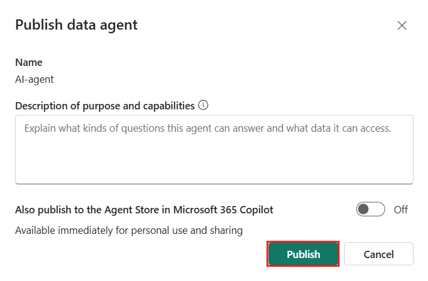

1. Click on the **View publishing details.**

   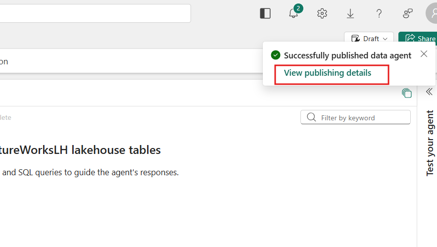

1. In the Data agent Fabric page, in the **Home** ribbon select the **Settings gear icon**.

   

1. Navigate to **Publishing (1)** section, and copy the **published URL (2)** value and paste it into the Notepad for further use, then click **X (3)** to close the AI-agent settings pane.

   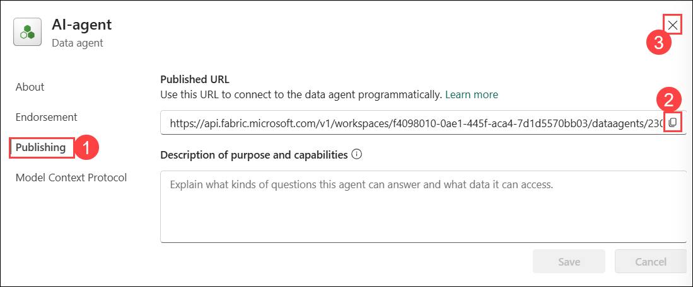

1. Navigate to the **Fabric Data agent-<inject key="DeploymentID" enableCopy="false"></inject> (1)** workspace and select **Notebook 1 (2)** to open the notebook for further analysis or execution.

   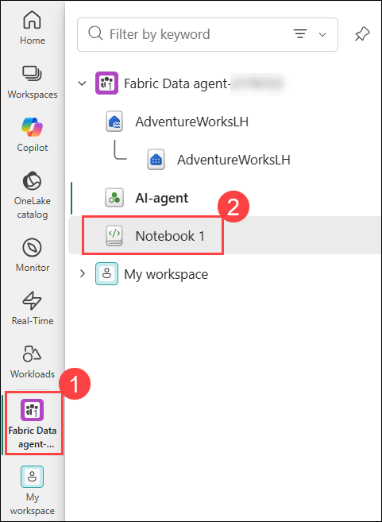

1. In your notebook, use the **+ Code (1)** icon below the output of last cell to add a new code cell to the notebook.

1. Enter the following code in the cell **(2)**. Select the code cell and click on the **Run cell (3)** button to execute cell. As an Output this code will install the required OpenAI package.

   ```
   %pip install "openai==1.70.0" 
   ```

   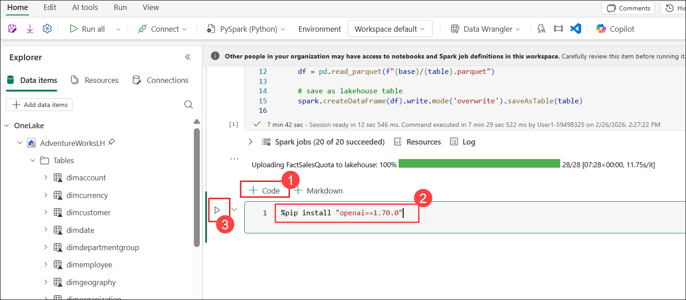

1. In your notebook, use the **+ Code** icon below the output of last cell to add a new code cell to the notebook.

1. Enter the following code in the cell **(1)**. Select the code cell and click on the **Run cell (2)** button to execute cell.

   ```
   %pip install httpx==0.27.2 
   ```

   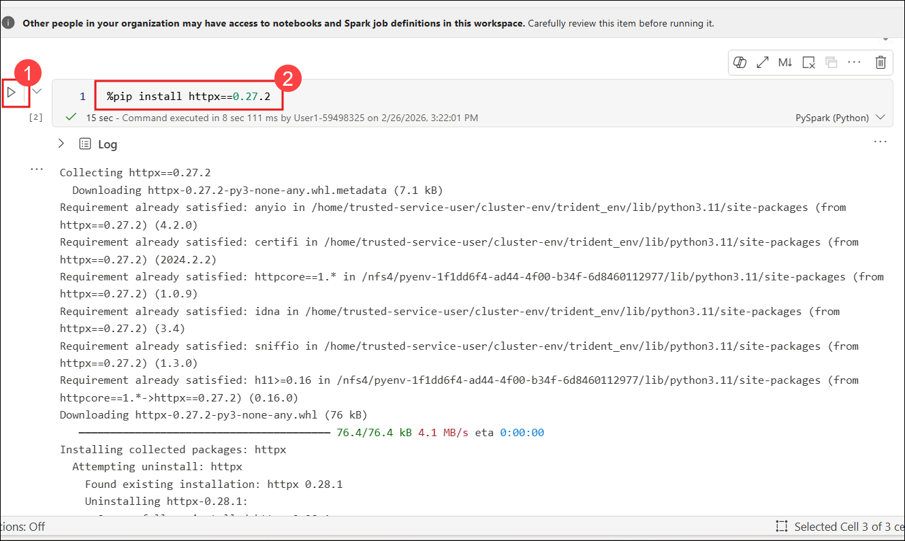

1. In your notebook, use the **+ Code** icon below the output of last cell to add a new code cell to the notebook.

1. Enter the following code in the cell and replace the **URL** with **Published URL** which you copied in the **Task 5 Step 6**, then select the code cell and click on the **Run cell (3)** button to execute cell.

   ```
   import requests
   import json
   import pprint
   import typing as t
   import time
   import uuid

   from openai import OpenAI
   from openai._exceptions import APIStatusError
   from openai._models import FinalRequestOptions
   from openai._types import Omit
   from openai._utils import is_given
   from synapse.ml.mlflow import get_mlflow_env_config
   from sempy.fabric._token_provider import SynapseTokenProvider

   base_url = "https://api.fabric.microsoft.com/v1/workspaces/989ec440-4aca-4a01-b19b-ba778325c043/dataagents/fa0d717a-6457-405c-8856-25bd4aabdd6a/aiassistant/openai"
   question = "What datasources do you have access to?"

   configs = get_mlflow_env_config()

   # Create OpenAI Client
   class FabricOpenAI(OpenAI):
       def __init__(
           self,
           api_version: str = "2024-05-01-preview",
           **kwargs: t.Any,
       ) -> None:
           self.api_version = api_version
           default_query = kwargs.pop("default_query", {})
           default_query["api-version"] = self.api_version

           super().__init__(
               api_key="",
               base_url=base_url,
               default_query=default_query,
               **kwargs,
           )

       def _prepare_options(self, options: FinalRequestOptions) -> None:
           headers: dict[str, str | Omit] = (
               {**options.headers} if is_given(options.headers) else {}
           )
           options.headers = headers

           headers["Authorization"] = f"Bearer {configs.driver_aad_token}"

           if "Accept" not in headers:
               headers["Accept"] = "application/json"

           if "ActivityId" not in headers:
               correlation_id = str(uuid.uuid4())
               headers["ActivityId"] = correlation_id

           return super()._prepare_options(options)

   # Pretty printing helper
   def pretty_print(messages):
       print("---Conversation---")
       for m in messages:
           print(f"{m.role}: {m.content[0].text.value}")
       print()

   fabric_client = FabricOpenAI()

   # Create assistant
   assistant = fabric_client.beta.assistants.create(model="not used")

   # Create thread
   thread = fabric_client.beta.threads.create()

   # Create message on thread
   message = fabric_client.beta.threads.messages.create(
       thread_id=thread.id,
       role="user",
       content=question,
   )

   # Create run
   run = fabric_client.beta.threads.runs.create(
       thread_id=thread.id,
       assistant_id=assistant.id,
   )

   # Wait for run to complete
   while run.status in ["queued", "in_progress"]:
       run = fabric_client.beta.threads.runs.retrieve(
           thread_id=thread.id,
           run_id=run.id,
       )
       print(run.status)
       time.sleep(2)

   # Print messages
   response = fabric_client.beta.threads.messages.list(
       thread_id=thread.id,
       order="asc",
   )
   pretty_print(response)

   # Delete thread
   fabric_client.beta.threads.delete(thread_id=thread.id)
   ```
   
   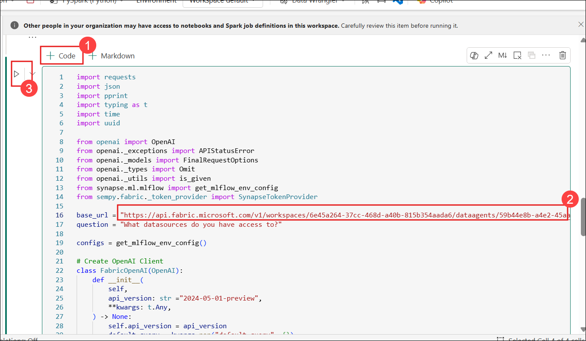

   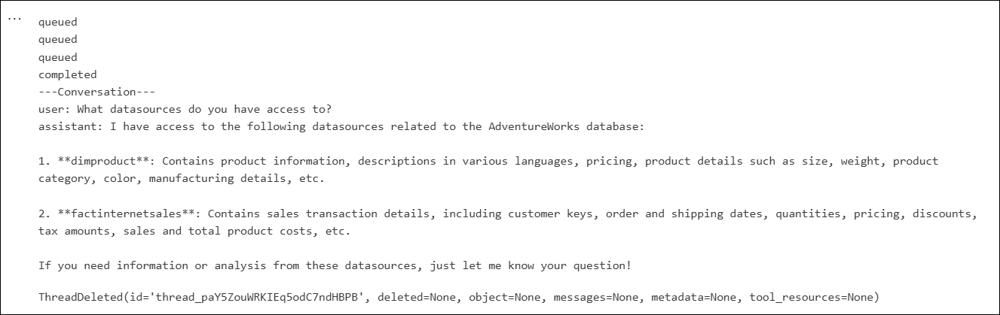

## Summary:

In this lab, you learned how to unlock the power of conversational analytics using Microsoft Fabric’s Data Agent. You configured a Fabric workspace, ingested structured data into a lakehouse, and set up an AI skill to translate natural language questions into SQL queries. You also enhanced the AI agent’s capabilities by providing instructions and examples to refine query generation. Finally, you called the agent programmatically from a Fabric notebook, demonstrating end-to-end AI integration. This lab empowers you to make enterprise data more accessible, usable, and intelligent for business users through natural language and generative AI technologies.

### You have successfully completed the lab. Click on Next >> to proceed with the next lab.


