# Usecase 03- Build Fabric Data Agent using Mirrored Azure SQL Database in Microsoft Fabric

## Introduction

Modern organizations require intelligent systems that can quickly
analyze operational data and provide meaningful insights without complex
data movement. In this use case, Microsoft Fabric is used to mirror data
from an Azure SQL Database into a Fabric environment and create a Fabric
Data Agent that can query and analyze the mirrored data.

The process begins with creating an Azure SQL Database containing sample
business data. This database is then mirrored into Microsoft Fabric
using Azure SQL Mirroring, enabling near real-time access to operational
data within the Fabric workspace. Once the mirrored database is
available, a Fabric Data Agent is configured to connect to the data
source and answer natural language queries.

This approach enables users to interact with enterprise data through
intelligent agents, allowing faster insights into product performance,
customer distribution, and sales trends without writing complex SQL
queries.

## Lab Objectives

In this lab, you will complete the following tasks:

- Task 1: Create a single database - Azure SQL Database
- Task 2: Create a Solution to Mirror Data using Azure SQL Mirroring
- Task 3: Create a Data Agent and Connect the Mirrored Database
- Task 4: Test the agent and Validate the agent responses using sample analytical questions.

## Task 1: Create a single database - Azure SQL Database

In this task, you will create a fully configured Azure SQL Database with
sample data. You will deploy the AdventureWorksLT sample schema, verify
tables, and prepare your server connection details for later mirroring
in Fabric.

1. On your LabVM, click on **Azure Portal** icon to navigate to the azure portal.

    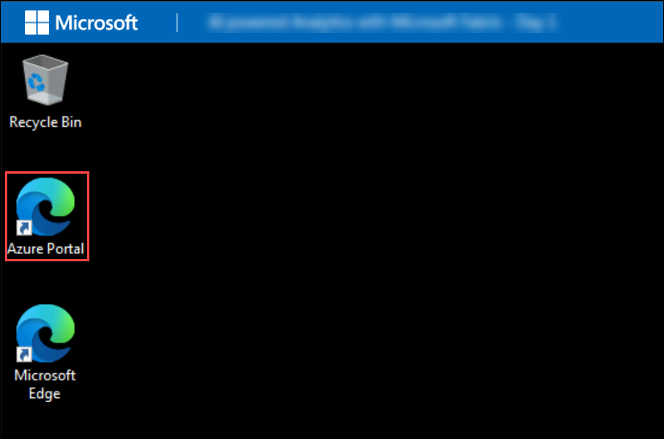

1. You'll see the **Sign into Microsoft Azure** tab. Here, enter your **Email** **(1)** and select **Next (2)**:

    - **Email/Username:** <inject key="AzureAdUserEmail"></inject>

        

1. Next, provide your **Password** **(1)** and click on **Sign in (2)**:

     - **Password:** <inject key="AzureAdUserPassword"></inject>

        

1. In the Azure portal search bar, search for **Azure SQL Database (1)** and select it from the results **Azure SQL Database (2)**.

    

1. On the **SQL databases** page, click **+ Create (1)** and then select **SQL database (2)** to open the configuration page for creating a new database.

    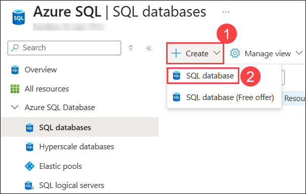

1. On **Create SQL Database** window, under the **Basics** tab, enter the following details:

    | Setting | Value |
    |--------|-------|
    | **Subscription** | Leave as default **(1)** |
    | **Resource group** | Select **lab-vm rg (2)**  |
    | **Database name** | **sqldatabase-<inject key="DeploymentID" enableCopy="false"></inject> (3)** |
    | **Server** | Select **Create new** (4) |

    

1. On **Create a SQL Database Server** window, enter the following server and authentication details, and click **OK (7).**

    | Setting | Value |
    |--------|-------|    
    | **Server name** | **sqlserver<inject key="DeploymentID" enableCopy="false"></inject> (1)** |
    | **Location** | <inject key="Region" enableCopy="false" ></inject> **(2)** |
    |**Authentication method**| **Use SQL Authentication (3)** |
    | **Server admin login** | **sqladmin (4)** |
    | **Password** | `password321!` **(5)** |
    | **Confirm password** | `password321!` **(6)** |

    

1. In the Compute + Storage section, click on **Configure database (1)**.

    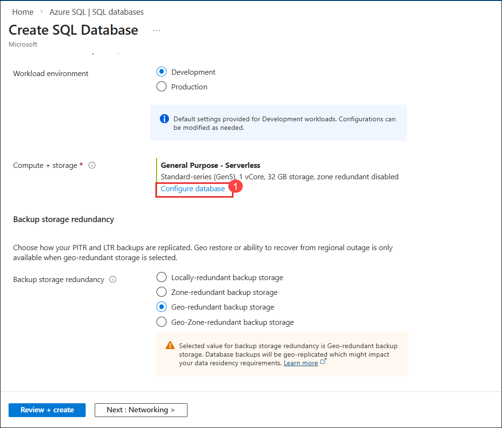

1. For Service tier from the dropdown select **Standard(Budget Friendly) (1)** and for **DTUs enter 100 (2)** and click **Apply (3).**

    

1. Verify that the **Compute + Storage** is updated to **Standard S3 (1)** SKU, click **Next : Networking > (2)**.

    

1. On the **Networking** tab, enable the following configurations and then click **Next: Security > (4).**

    - Connectivity method: select **Public endpoint (1)** 
    - **Allow Azure services and resources to access this server:** Set to **Yes (2)** 
    - **Add current client IP address:** Set to **Yes (3)** 

      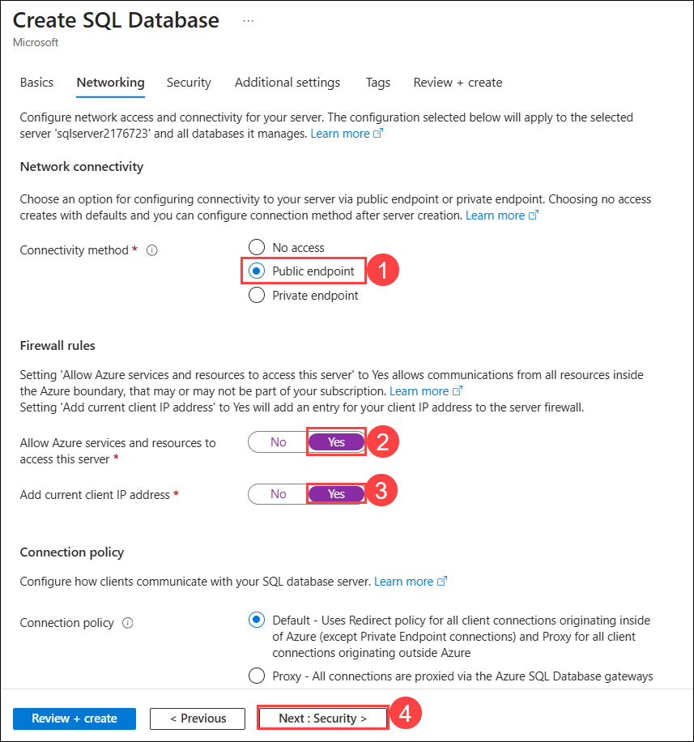

1. On the **Security** tab, keep everything as default select **Next : Additional settings >**

1. On **Additional settings** tab, select **Sample (1)** for **Use existing data** and click **OK (2)** for **AdventureWorksLT** dialog-box, then click **Review + create (3)**.

    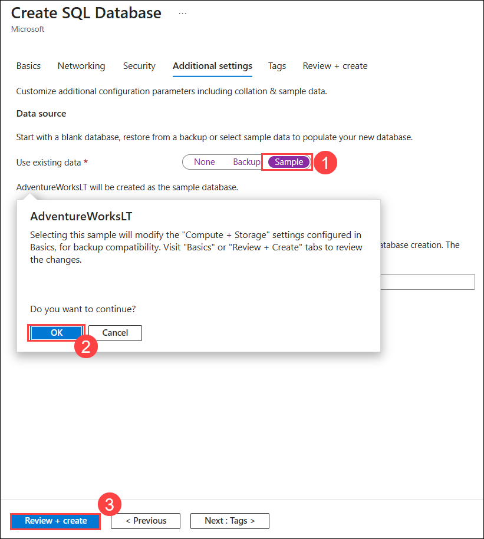

1. On the **Review + create** page, after reviewing, select **Create.**

    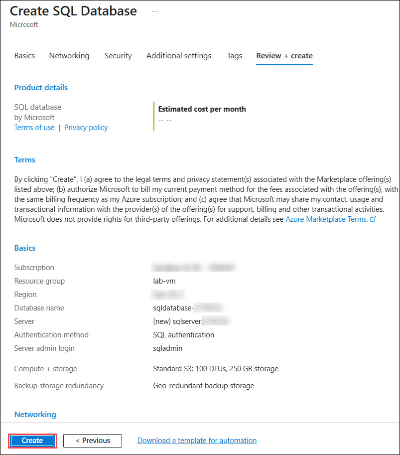

11. Once the deployment is completed, click on the **Go to resource** button.

    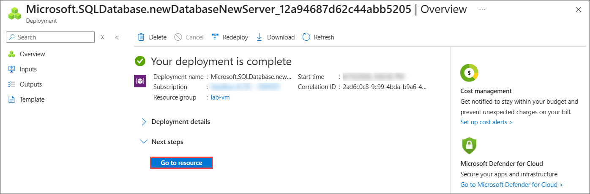

12. In SQL database page select **Query editor (preview) (1)** from the left navigation. In the **Query editor**, click **Classic experience (2)** to switch to classic Query editor.

    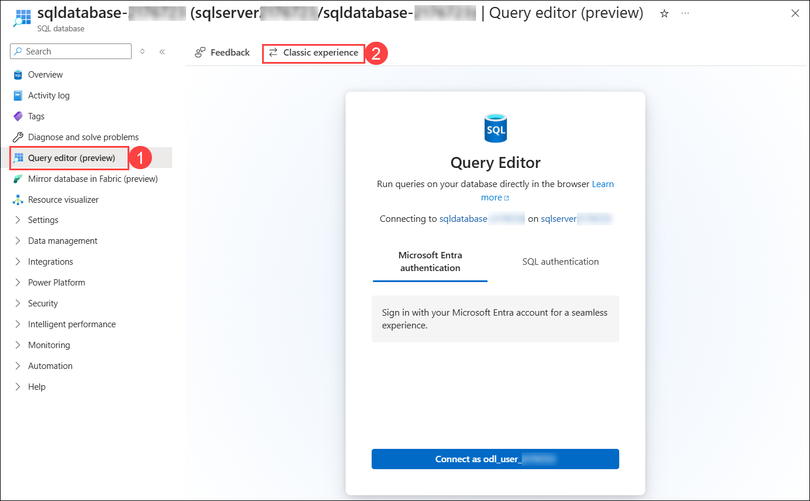

1. Enter the following credentials to authenticate to **SQL Server**, then click **OK (3)**.

    - **Login (1)**: 

        ```
        sqladmin 
        ```

    - **Password (2)**:
    
        ```
        password321!
        ```

       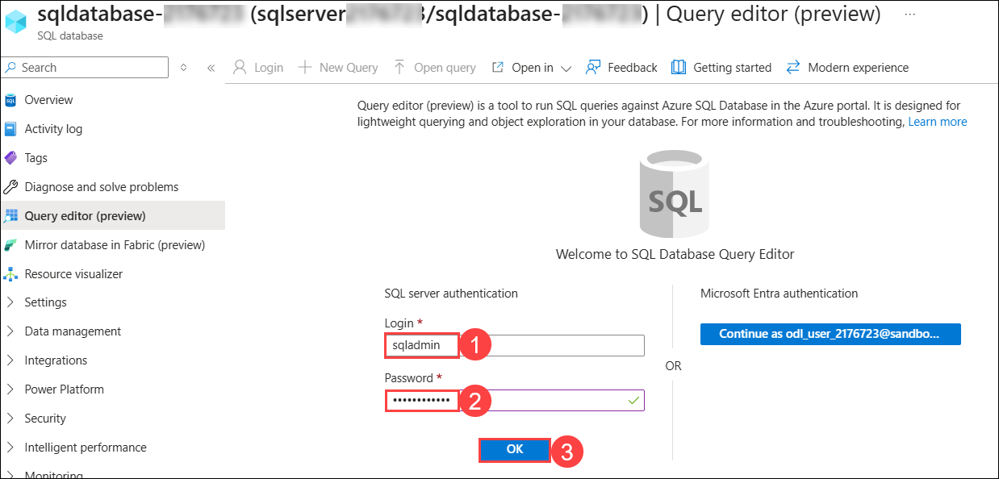

1. Make sure all the sample tables have been successfully deployed.

    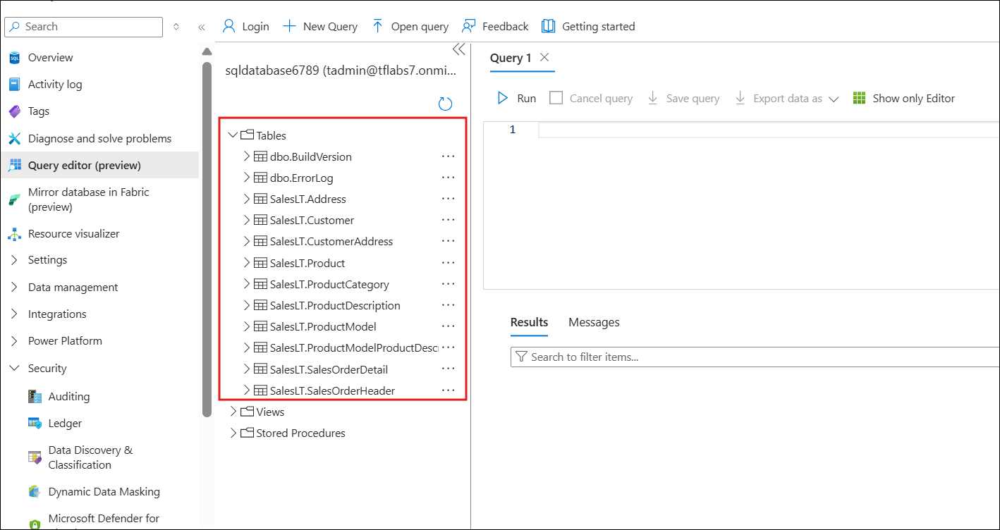

1. On SQL Database **Overview (1)** page, copy **Server name (2)** and **SQL Database name** **(3)** and paste them into the Notepad to use in the upcoming task.

   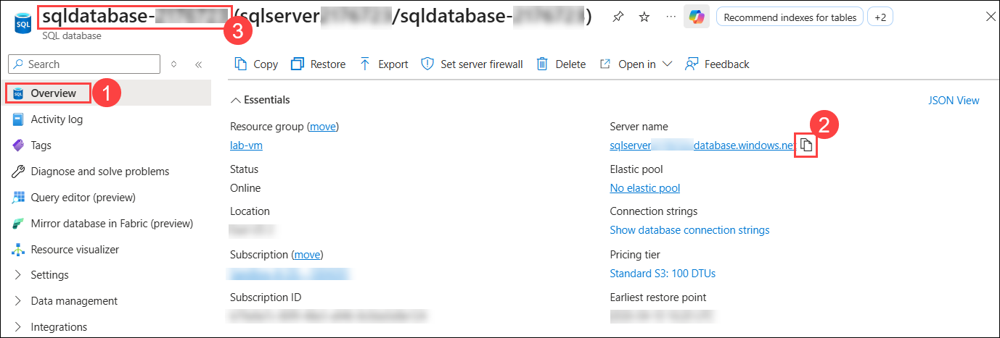

1. In the Azure portal search bar, search for **Resource groups (1)** and select **Resource gropus (2)** from the results.

   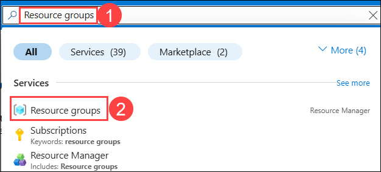

1. Click on the **lab-vm** resource group from the resource group list. 

    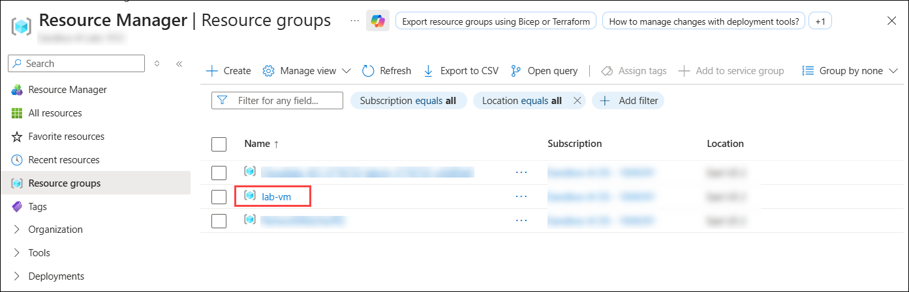

1. Select **SQL server<inject key="DeploymentID" enableCopy="false"></inject>** resource from the resources list.

    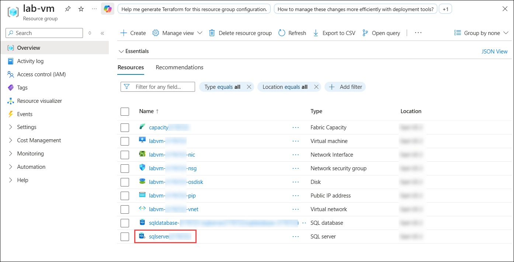

1. Navigate to **Identity(1)** from the left navigation, switch the System assigned managed identity status to **On (2)**, and then click **Save (3)** to apply the change.

    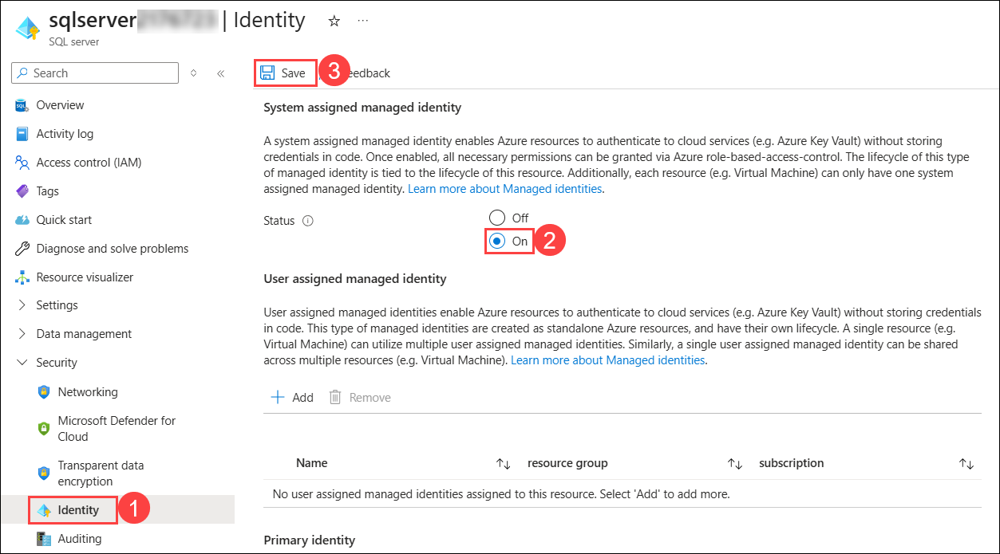

## Task 2: Create a Solution to Mirror Data using Azure SQL Mirroring

In this task, you will connect the Azure SQL Database to Microsoft
Fabric using Azure SQL Mirroring. You will select tables, create the
mirrored database, and validate that the data has synced successfully.

1. On your virtual machine, open the **Microsoft Edge**.
 
    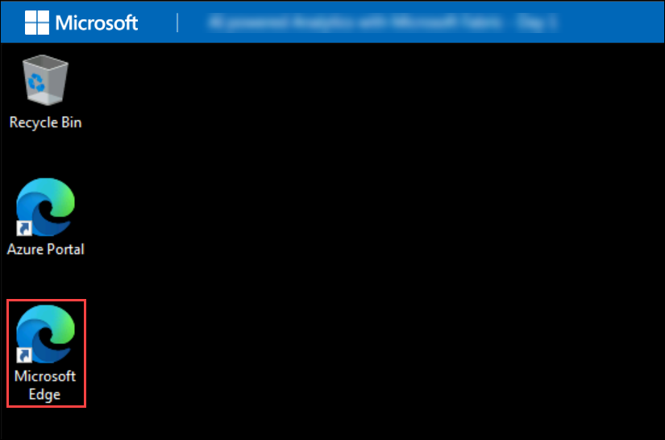
 
1.  In the new tab, navigate to the **Microsoft Fabric** portal by copying and pasting the following URL into the address bar.

      ```
      https://app.fabric.microsoft.com
      ```

1. On the **Enter your email, we'll check if you need to create a new account** tab, you will see the login screen, in that enter the following email/username, and click on **Submit (2)**.

   - **Email/Username:** <inject key="AzureAdUserEmail"></inject> **(1)**
 
        
 
1. Next, provide your Temporary Access Password **(1)** and click on **Sign in (2)**:
 
   - **Temprory Access Pass:** <inject key="AzureAdUserPassword"></inject>
 
       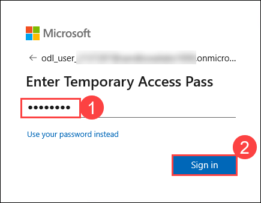

1. If you see the pop-up Stay Signed in?, select **No**.
   
    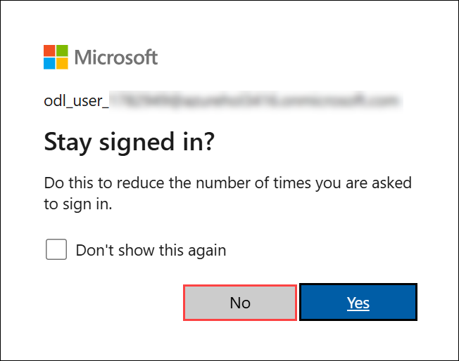

1. In the navigation bar, click on the **+ New item** button within the workspace **Fabric Data agent-<inject key="DeploymentID" enableCopy="false"></inject>**.

    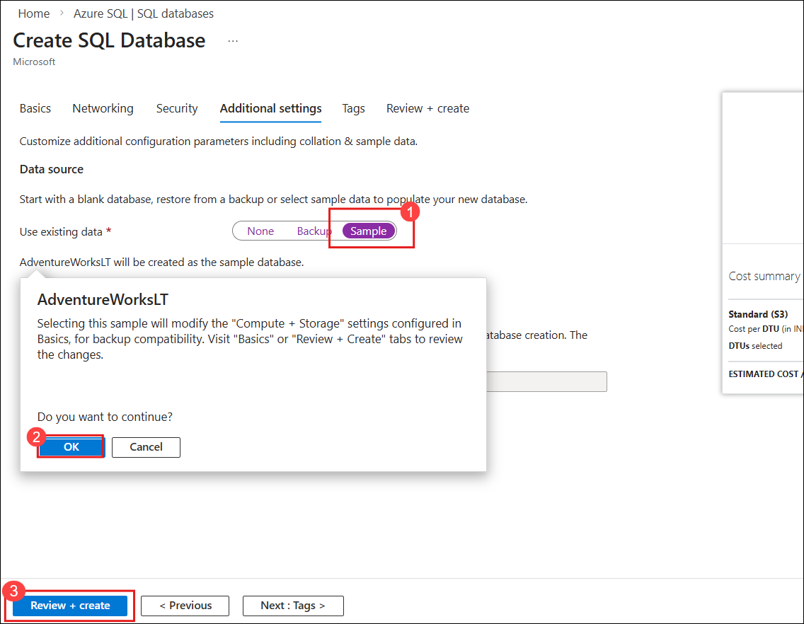

1. In the **Filter by keyword** search box, enter **Mirrored Azure SQL Database (1)** and select the **Mirrored Azure SQL Database (2)**
item.

    

1. In the **Choose a database connection to get started** window, select **Azure SQL database**

    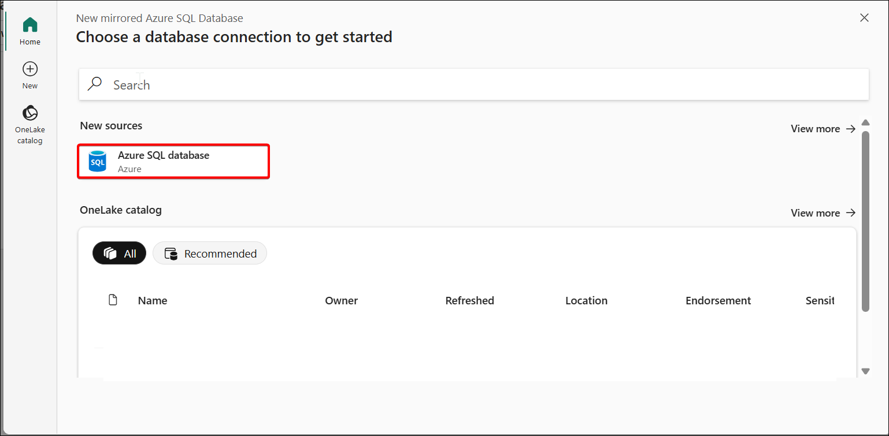

1. In Connection settings tab enter the below detail and click on Connect button

    | Setting   | Value |
    |-----------|-------|
    | **Server**   | Enter the Server name that you pasted in Task 1 Step 19 **(1)** |
    | **Database** | Enter **sqldatabase-<inject key="DeploymentID" enableCopy="false"></inject>** **(2)** |
    | **Username** | Enter `sqladmin` **(3)**|
    | **Password** | Enter `password321!` **(4)** |
    |**Connect**| Click on Connect **(5)**

    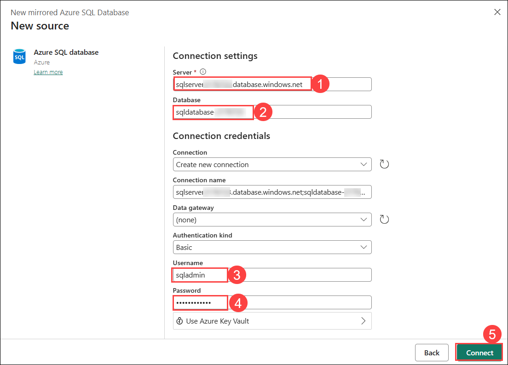

1. In the **Choose data** window, select **Select all (1)** and click on **Connect (2)** button

    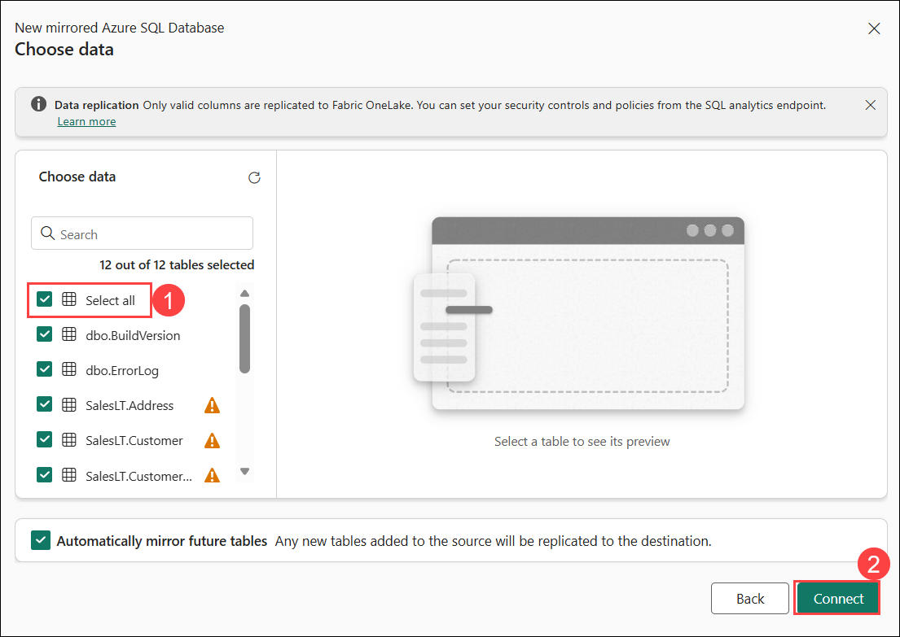

1. In the Destination tab, click on **Create mirrored database**

    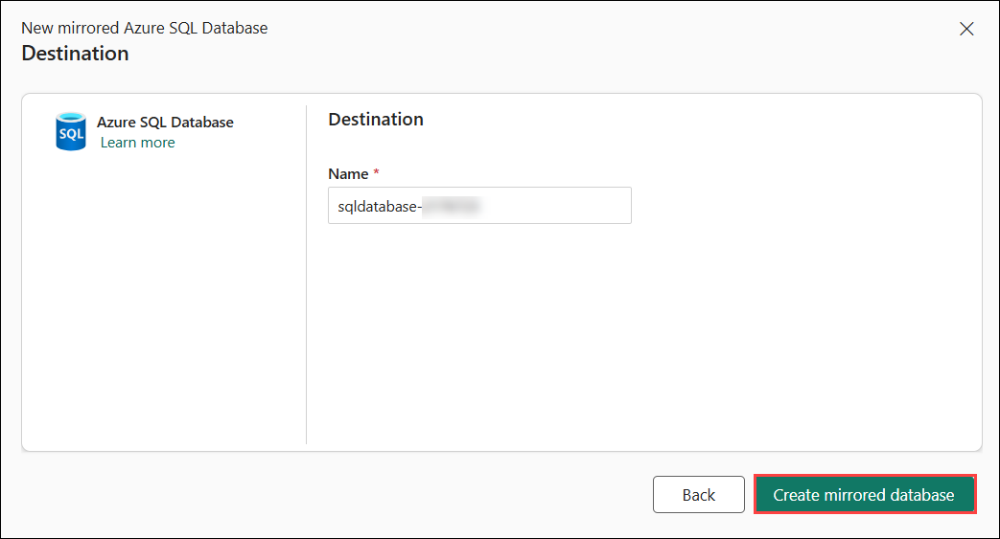

1. Click **Refresh** to update and view the latest changes.

    

    

## Task 3: Create a Data Agent and Connect the Mirrored Database

In this task, you will create a new Fabric Data Agent and configure it to use
the mirrored Azure SQL Database as its data source. This agent will
respond to natural language prompts using the mirrored data.

1. In the left-sided navigation menu, navigate and click on **Fabric Data agent-<inject key="DeploymentID" enableCopy="false"></inject>**.

    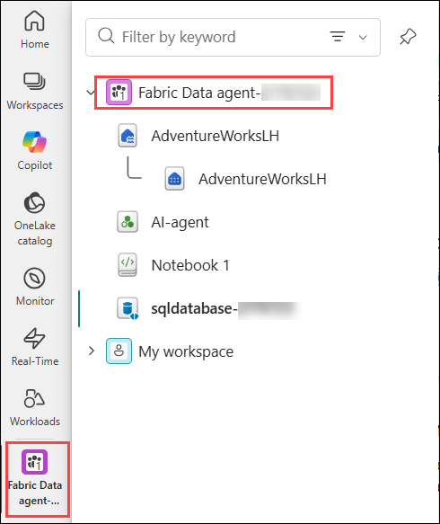

1. In the **Fabric Data agent-<inject key="DeploymentID" enableCopy="false"></inject>** workspace home page, select **+ New item.**

    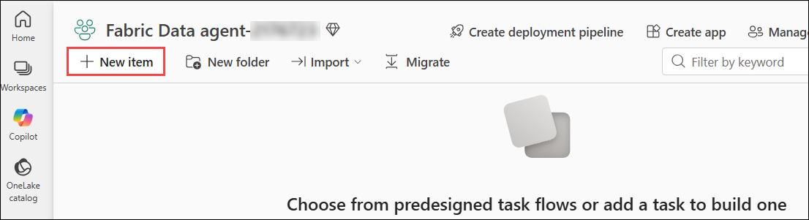

1. In New item pane, seacrch for **Data agent (1)** and select the **Data agent (2)**

    

1. Enter **FabricDataAgent-<inject key="DeploymentID" enableCopy="false"></inject>** **(1)** as the Data agent name and select **Create (2)**.

    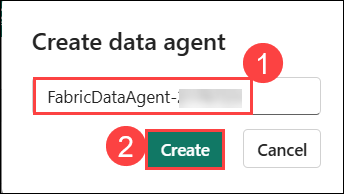

1. Select **Add data source** to configure a new data source.

    

1. Select **sqldatabse-<inject key="DeploymentID" enableCopy="false"></inject> (1)** Mirrored database resource, then click **Add (2).**

    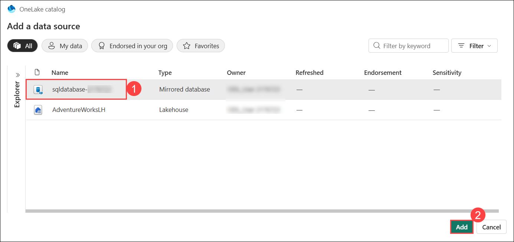

    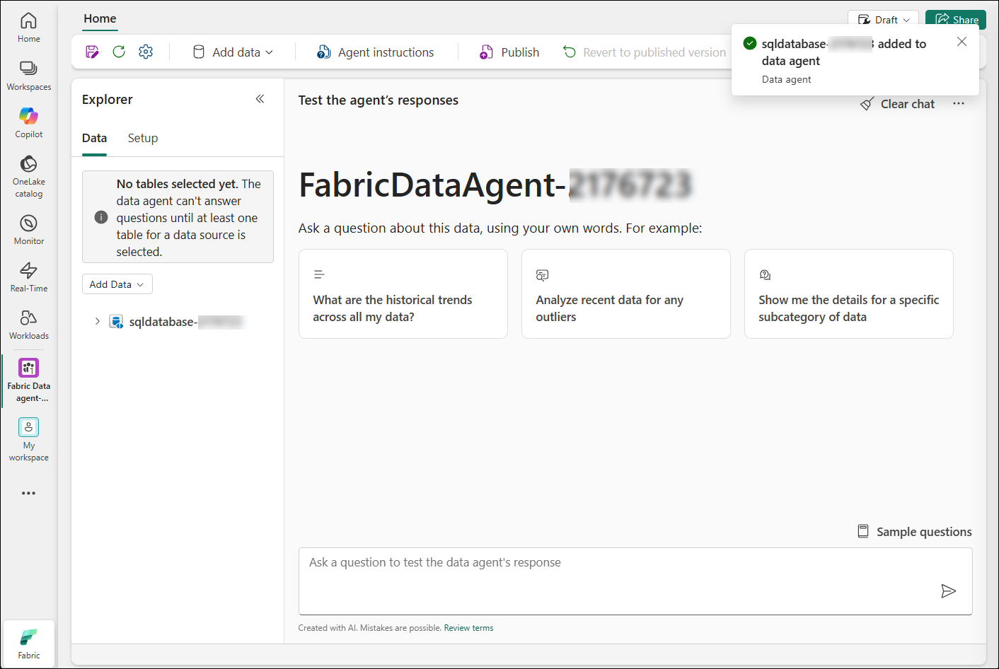

## Task 4: Test the agent and Validate the agent responses using sample analytical questions.

In this task, you will test the Data Agent by asking analytical questions like:

- Which product categories generate the highest sales?

- List products with high list price but low sales volume.

- Which cities have the highest number of customers?

This validates the agent’s ability to understand and respond to business
queries.

1 Expand the **sqldatabse-<inject key="DeploymentID" enableCopy="false"></inject> (1)**, navigate through **Schemas (2) → SalesLT (3) → Tables (4)**, and **select all (5)** the tables.

1. Enter the following **question (6)** in the query box: 

    ```
    Which product categories generate the highest sales?
    ```

1. Review the response (**7)**, which lists the top product categories along with their total sales amounts (e.g., Category ID 7, 6, and 5 as the highest).

    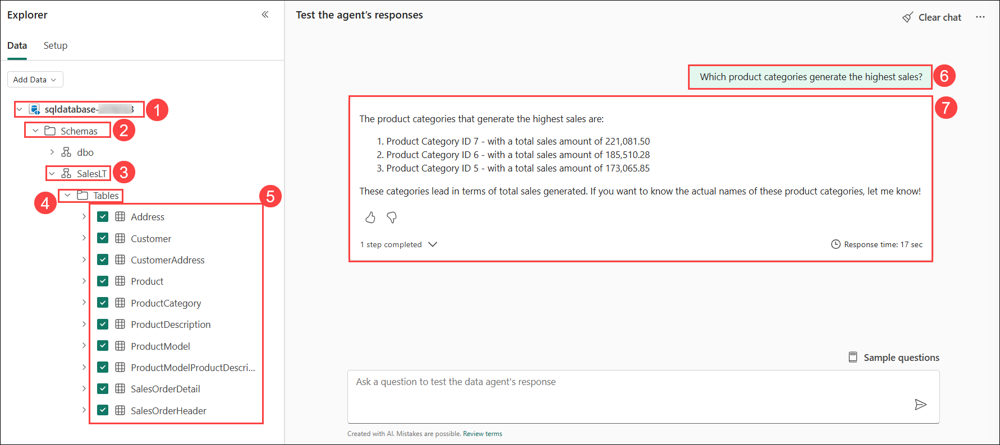

1.  To test the agent, run the application and enter the sample questions to verify the responses.

    ```
    List products with high list price but low sales volume. 
    ```

    

    

1. Similarly, enter the following **question** in the query box: 

    ```
     List the cities with the highest number of customers
    ```

    

    

1.  Click **Agent instructions** from top menu.

    

1.  Click Publish from the top menu and select **Publish**.

    

    

    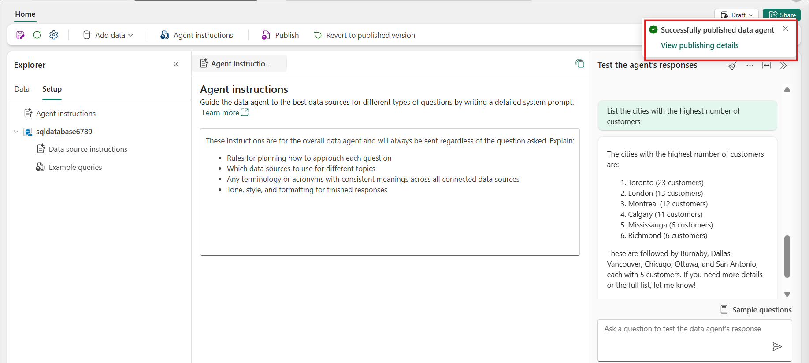

1.  Now, click on **Fabric Data agent-<inject key="DeploymentID" enableCopy="false"></inject>** on the left-sided navigation pane.

    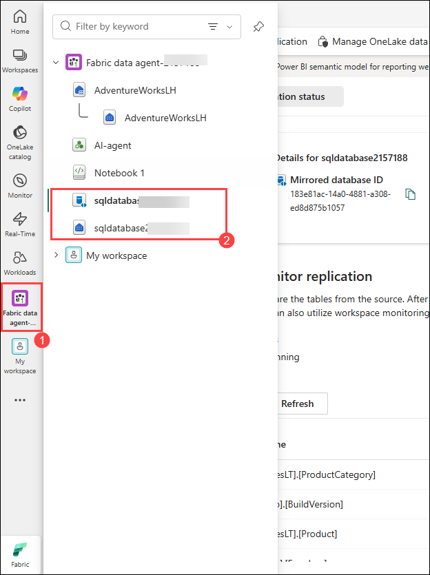

## Summary

In this lab, you successfully created an Azure SQL Database and mirrored
its data into Microsoft Fabric using Azure SQL Mirroring. You then
configured a Fabric Data Agent to connect to the mirrored database and
analyze the data through natural language queries.

The agent was able to answer analytical questions such as identifying
high-selling product categories, products with high prices but low
sales, and cities with the largest number of customers. This
demonstrates how Microsoft Fabric can integrate operational data sources
with intelligent agents to simplify data exploration and enable faster
business insights.

This use case highlights the power of combining **data mirroring and AI-powered data agents** to create interactive and intelligent data
experiences within the Microsoft Fabric ecosystem.

### Congratulations! You have successfully completed the lab.